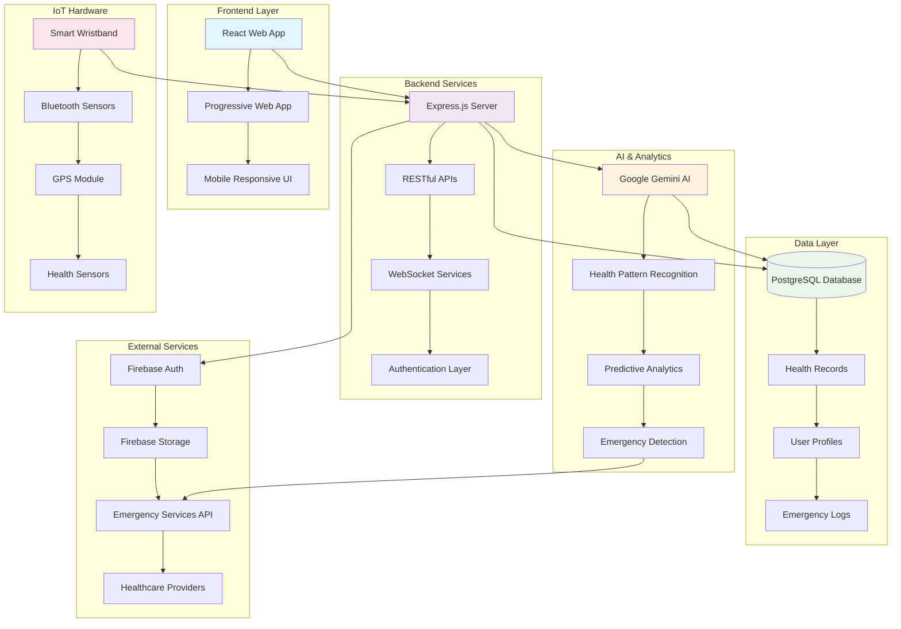
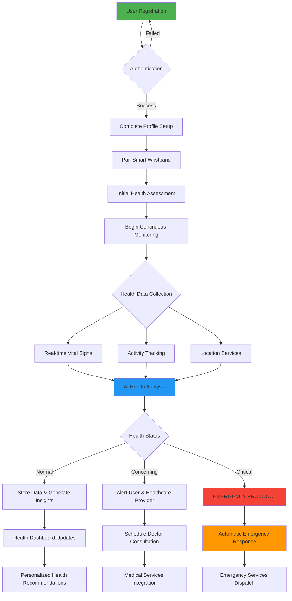
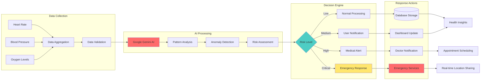
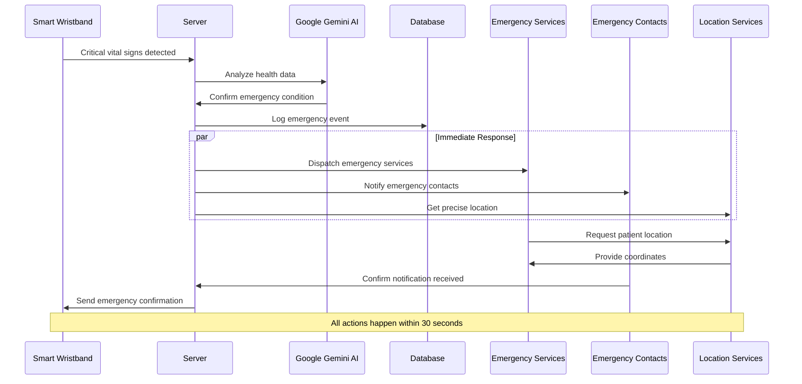
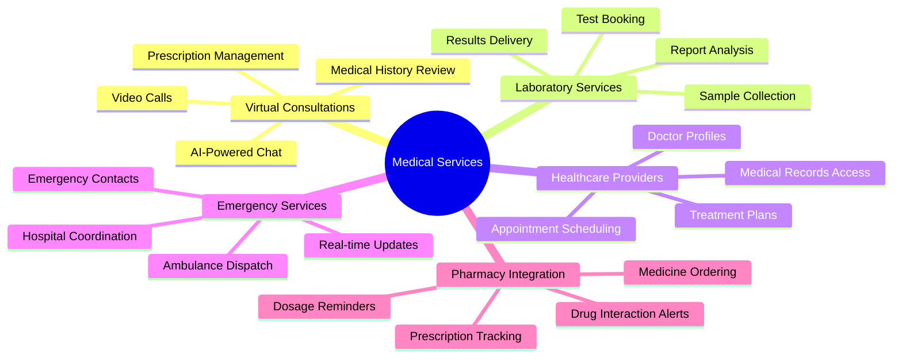
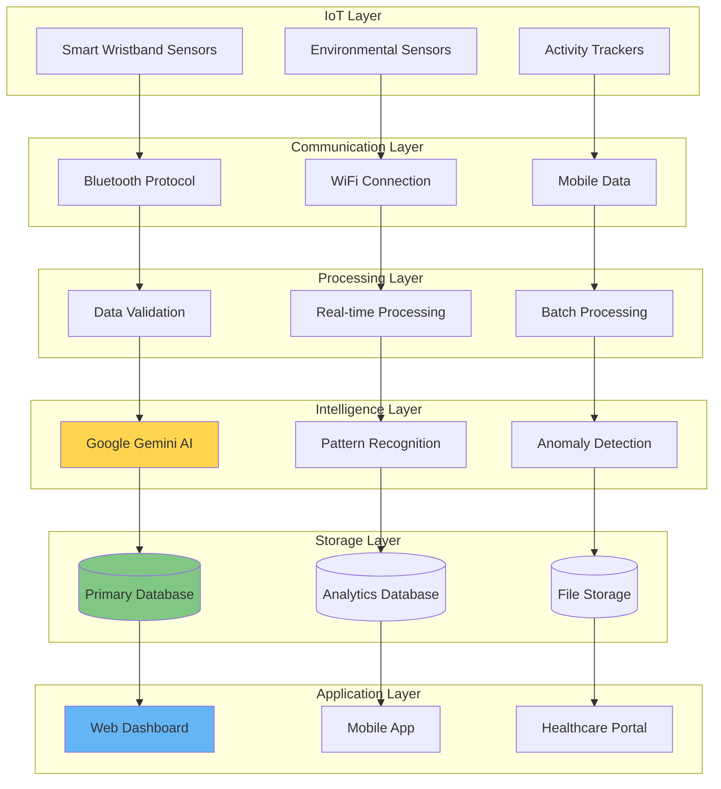
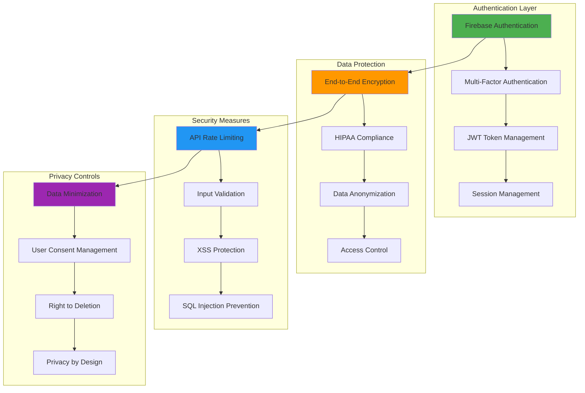

# Health Monitoring Platform - System Architecture & Flow

> **A comprehensive health monitoring system that combines smart wristband technology, AI-powered health analysis, and real-time emergency response capabilities.**

## 🏗️ System Architecture Overview



## 👤 User Journey Flow



## 🔄 Data Processing Pipeline



## 🚨 Emergency Response System



## 🏥 Medical Services Integration



## 🛠️ Technical Stack Architecture

```mermaid
graph TB
    subgraph "Frontend Technologies"
        A[React 18] --> B[TypeScript]
        B --> C[Tailwind CSS]
        C --> D[Framer Motion]
        D --> E[React Query]
    end
    
    subgraph "Backend Technologies"
        F[Node.js] --> G[Express.js]
        G --> H[TypeScript]
        H --> I[Passport.js Authentication]
        I --> J[WebSocket (ws)]
    end
    
    subgraph "Database & Storage"
        K[(PostgreSQL)] --> L[Drizzle ORM]
        L --> M[Neon Database]
        M --> N[Firebase Storage]
    end
    
    subgraph "AI & Machine Learning"
        O[Google Gemini AI] --> P[Health Pattern Recognition]
        P --> Q[Predictive Analytics]
        Q --> R[Natural Language Processing]
    end
    
    subgraph "External Integrations"
        S[Firebase Auth] --> T[Firebase Admin SDK]
        T --> U[Emergency Services APIs]
        U --> V[Healthcare Provider APIs]
    end
    
    subgraph "Hardware Integration"
        W[Bluetooth Low Energy] --> X[Health Sensors]
        X --> Y[GPS Module]
        Y --> Z[Real-time Communication]
    end
    
    A --> F
    F --> K
    F --> O
    F --> S
    W --> F
    
    style A fill:#61DAFB
    style F fill:#68A063
    style K fill:#336791
    style O fill:#DB4437
    style S fill:#FFCA28
    style W fill:#007ACC
```

## 📊 Data Flow Visualization



## 🔐 Security & Privacy Architecture



---

## 📋 System Capabilities

### 🏥 Core Health Monitoring
- **Real-time Vital Signs Tracking**: Continuous monitoring of heart rate, blood pressure, SpO2
- **AI-Powered Health Analysis**: Google Gemini AI for pattern recognition and health insights
- **Predictive Analytics**: Early warning system for potential health issues
- **Historical Data Analysis**: Long-term health trend tracking and analysis

### 🚨 Emergency Response
- **Automatic Emergency Detection**: AI-powered critical condition identification
- **One-Touch SOS**: Manual emergency activation with GPS location
- **Multi-Channel Alerts**: Simultaneous notification to emergency services and contacts
- **Real-time Location Tracking**: Precise GPS coordinates for emergency response

### 🩺 Medical Services Integration
- **Virtual Doctor Consultations**: AI-assisted medical consultations
- **Laboratory Test Booking**: Integrated pathology services
- **Prescription Management**: Medicine ordering and tracking
- **Healthcare Provider Network**: Connected medical professional ecosystem

### 📱 User Experience
- **Cross-Platform Compatibility**: Web and mobile responsive design
- **Multi-language Support**: Internationalization for global accessibility
- **Offline Functionality**: Local data storage with cloud synchronization
- **Personalized Dashboard**: Customized health insights and recommendations

---

*This flowchart documentation represents a modern, comprehensive health monitoring platform built with cutting-edge technology to provide proactive healthcare management and emergency response capabilities.*